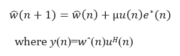
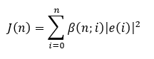
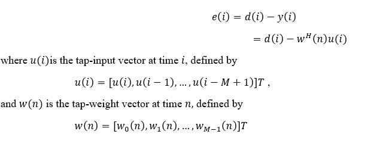
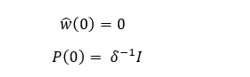

### a. Least Mean Square (LMS) and Recursive Least Squares (RLS) Adaptive Filters

#### **Least Mean Square (LMS) Adaptive Filter Concepts**

An adaptive filter is a computational device that iteratively models the relationship between the input and output signals of a filter. An adaptive filter self-adjusts the filter coefficients according to an adaptive algorithm.

Least Mean Squares (LMS) algorithms are a class of adaptive filters used to mimic a desired filter by finding the filter coefficients that produce the **least mean square of the error signal** (difference between the desired and the actual signal). It is a **stochastic gradient descent method**, meaning the filter adapts using only the error at the current time instant.

  
  
  <figcaption><strong>Fig. 1 Block Diagram of a Typical Adaptive Filter</strong></figcaption> 

#### **Signal Definitions**

- **x(n)**: Input signal to the linear filter  
- **y(n)**: Corresponding output signal  
- **d(n)**: Desired (reference) signal  
- **e(n)**: Error signal representing the difference between d(n) and y(n)  

The linear filter may be a **Finite Impulse Response (FIR)** or **Infinite Impulse Response (IIR)** filter.  
An adaptive algorithm iteratively adjusts the coefficients of the linear filter to minimize the power of the error signal **e(n)**.

The LMS algorithm is one of several adaptive algorithms used to adjust FIR filter coefficients. Another important adaptive algorithm is the **Recursive Least Squares (RLS)** algorithm.

### **LMS Algorithm Steps**

The LMS algorithm updates the coefficients of an adaptive FIR filter through the following steps:

#### **1. Calculate the Filter Output**

  
  
  <figcaption><strong>Fig. 2 LMS Filter Output Computation</strong></figcaption> 

#### **2. Calculate the Error Signal**

e(n) = d(n) - y(n)

#### **3. Update the Filter Coefficients**

  
  
  <figcaption><strong>Fig. 3 LMS Coefficient Update Rule</strong></figcaption> 

Where:

- **μ**: Step size of the adaptive filter  
- **w(n)**: Filter coefficient vector  
- **u(n)**: Filter input vector  

### **Advantages of LMS**

- Simple and easy to implement  
- Low computational complexity  
- Good convergence in stable environments  
- Improved time-domain waveform tracking  

### **Limitations of LMS**

- Low convergence rate  
- Poor performance at low signal-to-noise ratio (SNR)  

### **Recursive Least Squares (RLS)**

Adaptive filtering automatically adjusts filter coefficients to achieve desired filtering characteristics. The **Recursive Least Squares (RLS)** algorithm is a powerful adaptive filtering technique known for its **rapid convergence and high accuracy**.

RLS is widely used in applications such as:

- Noise cancellation  
- Echo cancellation  
- System identification  

The goal of adaptive filtering is to minimize the difference between the desired signal and the actual output. The RLS algorithm achieves this by recursively minimizing a **weighted least squares cost function** using both past and present error samples.

### **Mathematical Foundation of RLS**

The RLS algorithm minimizes the following cost function **J(n)**:

  
  
  <figcaption><strong>Fig. 4 RLS Cost Function</strong></figcaption> 

Where the error is defined as:

  
  
  <figcaption><strong>Fig. 5 RLS Error Definition</strong></figcaption> 

Here:

- **e(i)** is the difference between desired response **d(i)** and filter output **y(i)**  
- The FIR filter tap weights remain fixed during the observation interval  
- 1 \le i \le n

The weighting factor **β(n, i)** satisfies:

0 < \beta(n, i) \le 1

### **Forgetting Factor**

The weighting factor ensures older data is gradually “forgotten” to allow tracking of time-varying signals.

A commonly used weighting is the **exponential forgetting factor**:

\beta(n, i) = \lambda^{(n - i)}, \quad i = 1, 2, \ldots, n

Where:

- **λ** is close to but less than 1  
- λ = 1 → Infinite memory (ordinary least squares)  
- \frac{1}{1 - \lambda} approximately represents algorithm memory  

### **RLS Initialization**

The RLS algorithm is initialized as follows:

  
  
  <figcaption><strong>Fig. 6 RLS Initialization</strong></figcaption> 

Where **δ** is the regularization parameter:

- Small δ → High SNR  
- Large δ → Low SNR  

### **Recursive Update Equations**

For each time instant n = 1, 2, \ldots, the following computations are performed:

  
  
  <figcaption><strong>Fig. 7 RLS Recursive Update Equations</strong></figcaption> 

### **Signal Flow Graph**

  
  
  <figcaption><strong>Fig. 8 RLS Signal Flow Graph</strong></figcaption> 

### **Advantages of RLS**

- Very fast convergence  
- High accuracy in coefficient estimation  
- Excellent tracking of time-varying systems  

### **Limitations of RLS**

- High computational complexity  
- Large memory requirement due to inverse correlation matrix storage  

### **Comparison of LMS and RLS Adaptive Filters**

Least Mean Squares (LMS) algorithms are the simplest adaptive filtering techniques and are easy to implement. Recursive Least Squares (RLS) algorithms offer superior performance and faster convergence at the cost of increased computational complexity.

RLS approaches the performance of the **Kalman filter** while requiring less throughput in signal processing.

Although LMS and RLS share the same signal paths and filter structure, they differ in **how coefficients are adapted**:

- **LMS** adapts based on instantaneous error  
- **RLS** adapts using total accumulated weighted error  

LMS uses a gradient-based approach with a step size μ:
- Small μ → Slow but stable convergence  
- Large μ → Fast but potentially unstable  

RLS minimizes a global least-squares cost function and adapts much faster.

### **Summary**

- **LMS** is simple, stable, and computationally efficient but converges slowly  
- **RLS** provides faster convergence and higher accuracy at increased computational cost  
- LMS is suitable for low-resource systems  
- RLS is preferred for high-performance and fast-tracking applications  

## b. **Autoregressive Model**

A statistical model is said to be **autoregressive** if it predicts future values based on past values. For example, an autoregressive model may be used to predict a stock’s future price based on its historical performance.

### **Basic Concept of Autoregressive Models**

Autoregressive models operate under the premise that **past values influence current values**, which makes this statistical technique popular for analyzing natural phenomena, economics, and other time-varying processes.

Multiple regression models forecast a variable using a linear combination of predictors, whereas **autoregressive models use a linear combination of past values of the same variable**.

- **AR(1)** process: Current value depends on the immediately preceding value  
- **AR(2)** process: Current value depends on the previous two values  
- **AR(0)** process: Represents **white noise**, with no dependence between terms  

There are various methods to estimate the coefficients of AR models, such as the **least squares method**.

### **Block Diagram of an Autoregressive Model**

  
  
  <figcaption><strong>Fig. 1 Block Diagram of an Autoregressive Model</strong></figcaption> 

### **Second Order Autoregressive Process**

Consider a **second-order autoregressive (AR(2)) process** that is real-valued.  
The above figure illustrates the block diagram of the model used to generate this process.

The time-domain behavior of the AR(2) process is governed by the following **second-order difference equation**:

  

u(n) + a_1 u(n-1) + a_2 u(n-2) = v(n)

Where:

- **u(n)** is the output of the AR process  
- **a₁, a₂** are autoregressive coefficients  
- **v(n)** is a white noise sequence with  
  - Zero mean  
  - Variance \sigma^2

### **Key Characteristics of AR Models**

- Output depends on past outputs  
- Suitable for time-series analysis  
- Widely used in signal processing, economics, and forecasting  
- Model order determines memory depth  

### **Summary**

- Autoregressive models predict current values using past observations  
- AR(1), AR(2), and AR(0) represent increasing levels of dependency  
- AR(2) models are governed by second-order difference equations  
- White noise acts as the driving input to the system  

